<!-- PROJECT TITLE -->

<br />
<div align="center">
  <h1>End-to-End DevSecOps & GitOps CI/CD Pipeline for MERN Chat Application (ChitChat)</h1>
</div>

---

<br />

##  Overview

- This project demonstrates an end-to-end DevSecOps and GitOps-based CI/CD pipeline for deploying a MERN chat application (ChitChat) on AWS EKS.
- The primary goal of this project is to learn how to deploy and manage applications on Kubernetes using modern DevOps practices and tools.
- It covers the complete workflow from code commit to production deployment, including automated build, security checks, containerization, and GitOps-based delivery.
- Security is integrated at multiple stages of the pipeline to ensure safe and reliable deployments.
- The project also focuses on understanding real-world deployment strategies using Kubernetes and cloud infrastructure.
- Monitoring is implemented to track application performance and system health.
- Overall, this project reflects how modern applications are built, secured, and deployed in a scalable and automated way.

---

<br />

##  Architecture Diagram (CI/CD & Project Flow)

<p align="center">
  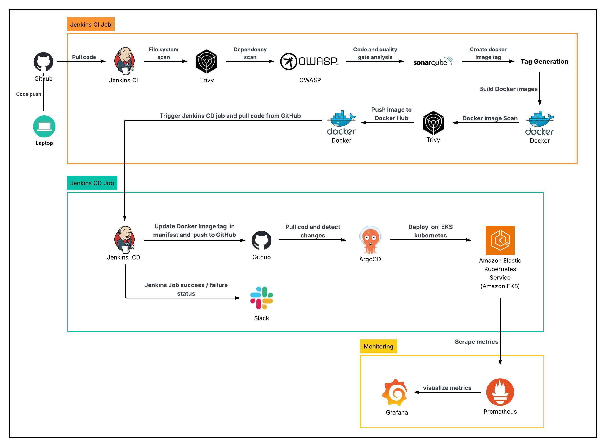
</p>

This diagram represents the complete DevSecOps and GitOps-based CI/CD workflow of the project. Code pushed to GitHub is processed through Jenkins, where it goes through multiple stages like security scanning, quality checks, and Docker image creation.

The built images are pushed to Docker Hub, after which the CD pipeline updates the Kubernetes manifests. ArgoCD then detects these changes and automatically deploys the updated application to the EKS cluster.

This flow ensures automated, secure, and consistent deployments using GitOps principles.

---

<br />

##  User Request Flow Diagram

<p align="center">
  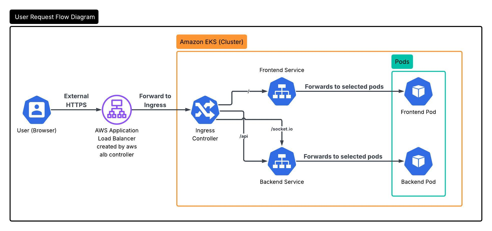
</p>

This diagram shows how user requests are handled in the deployed application. Incoming requests from the browser first reach the AWS Application Load Balancer (ALB), which forwards them to the Kubernetes Ingress controller inside the EKS cluster.

The Ingress routes traffic based on path rules:

- `/` is routed to the frontend service
- `/api` and `/socket.io` are routed to the backend service

The services then forward requests to the appropriate pods running the application.

> ⚠️ **Note:** This project uses the ALB DNS provided by AWS for testing purposes. A custom domain (DNS) is not configured, so all requests are accessed using the ALB endpoint.

---

<br />

##  Tech Stack

###  CI/CD & DevOps

| Tool                                                                                                          | Description                                              |
| ------------------------------------------------------------------------------------------------------------- | -------------------------------------------------------- |
|      | Automates CI/CD pipeline for build, scan, and deployment |
|        | Manages source code and triggers pipelines               |
|        | Containerizes frontend and backend services              |
|  | Stores and distributes Docker images                     |

###  DevSecOps Tools

| Tool                                                                                                          | Description                                            |
| ------------------------------------------------------------------------------------------------------------- | ------------------------------------------------------ |
|                                     | Scans filesystem and Docker images for vulnerabilities |
|          | Detects vulnerable dependencies                        |
|  | Ensures code quality with analysis and quality gates   |

###  Container Orchestration & GitOps

| Tool                                                                                                             | Description                        |
| ---------------------------------------------------------------------------------------------------------------- | ---------------------------------- |
|   | Manages containerized applications |
|  | Runs Kubernetes cluster on AWS     |
|             | Enables GitOps-based deployments   |

###  Networking & Cloud

| Tool                                                                                                                              | Description                                     |
| --------------------------------------------------------------------------------------------------------------------------------- | ----------------------------------------------- |
|                            | Provides cloud infrastructure                   |
|  | Routes external traffic to services via Ingress |

###  Monitoring & Observability

| Tool                                                                                                            | Description                        |
| --------------------------------------------------------------------------------------------------------------- | ---------------------------------- |
|  | Collects metrics from the cluster  |
|        | Visualizes metrics with dashboards |

###  Notifications

| Tool                                                                                                  | Description                 |
| ----------------------------------------------------------------------------------------------------- | --------------------------- |
|  | Sends CI/CD pipeline alerts |

---

<br />

##  CI/CD Pipeline Flow

The project follows an end-to-end DevSecOps and GitOps-based CI/CD workflow:

1. Developer pushes code to GitHub repository
2. Jenkins pipeline is triggered
3. Jenkins pulls the latest code from the repository
4. Trivy performs filesystem (FS) scan on the source code
5. OWASP Dependency Check scans for vulnerable dependencies
6. SonarQube performs code quality analysis
7. SonarQube Quality Gate is evaluated (non-blocking)
8. Docker image tag is generated (version + commit SHA)
9. Docker images (frontend & backend) are built
10. Trivy scans Docker images for vulnerabilities
11. Docker images are pushed to Docker Hub
12. Jenkins CD job updates Kubernetes manifests with new image tag
13. Updated manifests are pushed to GitHub repository
14. ArgoCD detects changes and automatically syncs
15. Application is deployed to the EKS cluster
16. Slack notifications are sent for pipeline success and failure

This pipeline ensures automated, secure, and consistent deployments using DevSecOps and GitOps practices.

---

<br />

##  DevSecOps Implementation

Security is integrated across the pipeline to ensure safe deployments:

- SonarQube is used for static code analysis and quality checks
- OWASP Dependency Check identifies vulnerable dependencies
- Trivy performs both filesystem and Docker image vulnerability scanning
- The application is deployed securely using private EKS nodes with controlled network access

This ensures a secure and reliable DevSecOps workflow.

---

<br />

##  Repository Structure

The repository is organized to separate application code, Kubernetes manifests, and infrastructure configurations:

```bash id="3x7kq2"
chitchat-devops-cicd/
├── client/                         # Frontend (React application)
├── server/                         # Backend (Node.js / Express API)
│
├── k8s/                            # Kubernetes manifests
│   ├── client/                     # Frontend resources
│   │   ├── client-deployment.yaml  # Frontend pods
│   │   └── client-service.yaml     # Frontend service
│   │
│   ├── server/                     # Backend resources
│   │   ├── server-deployment.yaml      # Backend pods
│   │   ├── server-service.yaml         # Backend service
│   │   ├── server-configMap.yaml       # Configuration data
│   │   ├── server-secret.yaml          # Sensitive data (example file)
│   │   └── server-servicemonitor.yaml  # Prometheus metrics
│   │
│   └── common/                     # Shared resources
│       ├── namespace.yaml          # Namespace definition
│       ├── ingress.yaml            # ALB routing (Ingress)
│       └── argocd-application.yaml # ArgoCD config
│
├── Jenkinsfile-ci                  # CI pipeline
├── Jenkinsfile-cd                  # CD pipeline
│
├── compose.yaml                    # Local Docker setup
├── eks-cluster.yaml                # EKS cluster config
├── .env.example                    # Environment variables (example file)
│
└── README.md                       # Project documentation
```

---
<br />

##  Infrastructure Setup

The project is deployed on AWS using a secure and scalable architecture:

• A custom VPC is configured with both public and private subnets  

• An EC2 instance in the public subnet is used to run Jenkins and DevSecOps tools  

• Amazon EKS cluster is deployed in private subnets with worker nodes to run the application  

• An Application Load Balancer (ALB) is automatically created and managed by the AWS Load Balancer Controller (Ingress) to expose the application externally  

• NAT Gateway is used to allow private subnet resources to access the internet securely  

This setup ensures a secure, isolated, and production-like environment for deploying the application.

---

<br />

##  Project Screenshots & Proof

This section showcases the complete implementation of the DevSecOps and GitOps pipeline, along with the deployed infrastructure and application.

---

###  Live Application (Frontend + Real-Time Chat)

<p align="center">
  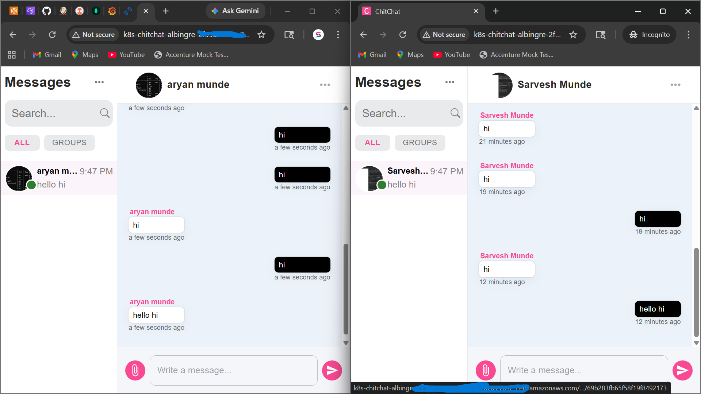
</p>

This screenshot shows the deployed MERN chat application running on AWS EKS.  
It demonstrates real-time communication between users, proving that the frontend, backend, and WebSocket communication are working correctly in the deployed environment.

---

###  Continuous Integration Pipeline (Jenkins CI)

<p align="center">
  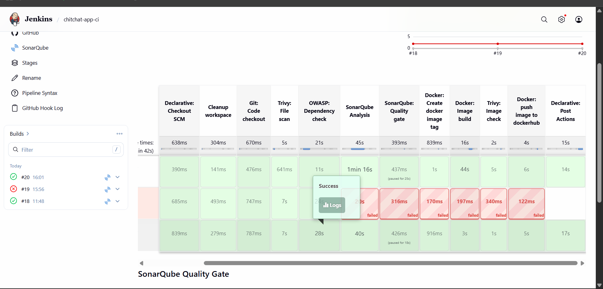
</p>

This screenshot represents the Jenkins Continuous Integration (CI) pipeline used in the project.

It includes multiple automated stages such as:

- Source code checkout from GitHub  
- Trivy filesystem scan for vulnerabilities  
- OWASP Dependency Check for insecure libraries  
- SonarQube analysis for code quality  
- Quality Gate evaluation  
- Docker image build and tagging  
- Docker image security scan  
- Pushing images to Docker Hub  

This ensures that the application code is tested, analyzed, and secured before deployment.

---

###  Continuous Deployment Pipeline (Jenkins CD)

<p align="center">
  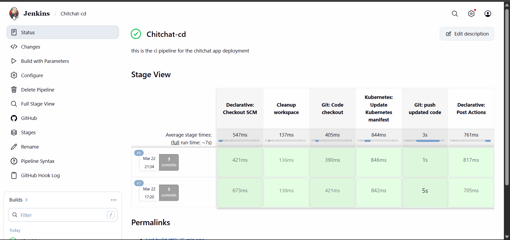
</p>

This represents the Continuous Deployment pipeline where:

- Kubernetes manifests are updated with new image tags  
- Changes are pushed to GitHub  
- ArgoCD automatically deploys updates to the cluster  

This confirms that the CD pipeline is fully automated and functional.

---

###  GitOps Deployment (ArgoCD Application)

<p align="center">
  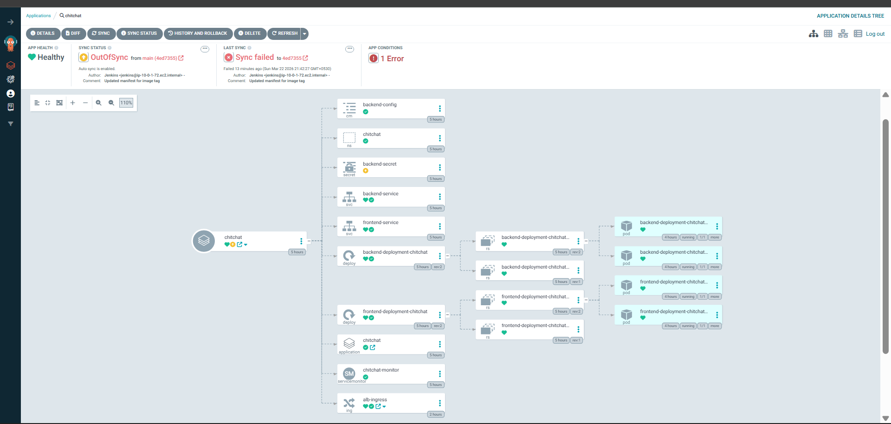
</p>

This screenshot shows the ArgoCD application tree, including:

- Namespace  
- Deployments (frontend & backend)  
- Services  
- Ingress (ALB)  
- Pods  

All resources are managed using GitOps, ensuring consistency between Git and the cluster.

> ⚠️ **Note:** The `backend-secret.yaml` is intentionally not committed to GitHub for security reasons.  
> It is applied manually in the cluster, which may cause ArgoCD to show an `OutOfSync` or `Sync Failed` status for that specific resource.  
> This is expected behavior and reflects secure handling of sensitive data in real-world deployments.

---

###  AWS VPC Architecture

<p align="center">
  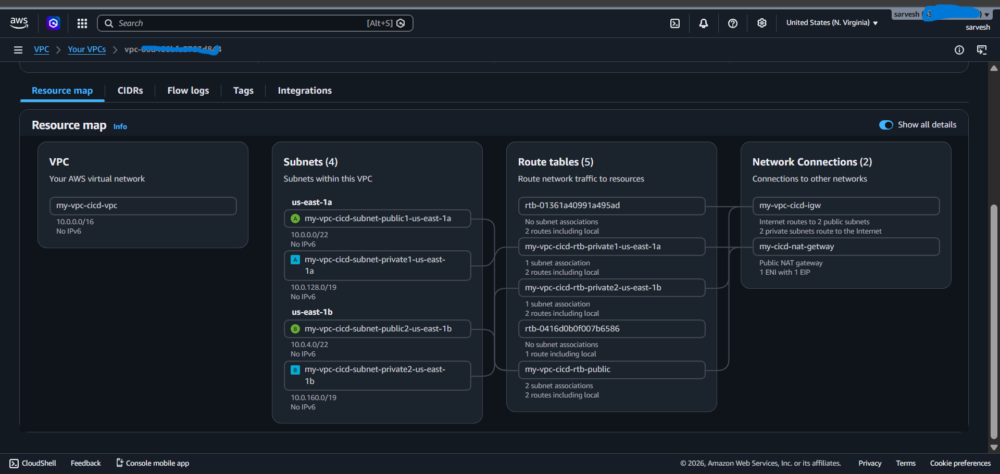
</p>

This shows the custom AWS networking setup:

- Public and private subnets  
- Route tables  
- Internet Gateway (IGW)  
- NAT Gateway  

This architecture ensures that the EKS cluster runs securely in private subnets while still allowing controlled internet access.

---

###  Application Load Balancer (ALB - Path Routing)

<p align="center">
  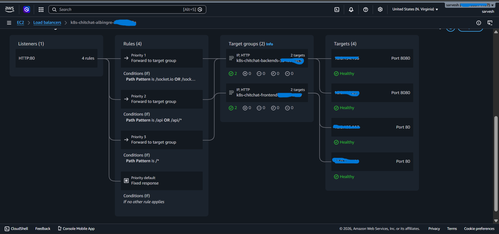
</p>

This demonstrates path-based routing configured via Kubernetes Ingress:

- `/` → Frontend service  
- `/api` → Backend service  
- `/socket.io` → Backend service  

It confirms proper traffic routing from the ALB to Kubernetes services.

---

###  Amazon EKS Cluster

<p align="center">
  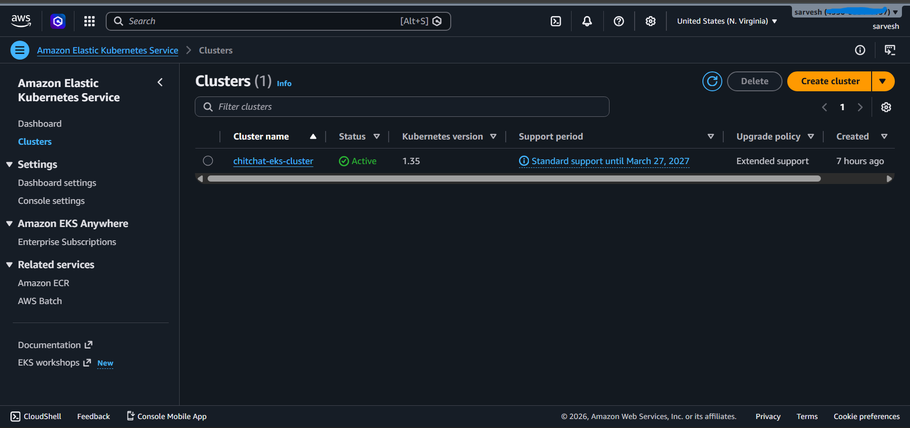
</p>

This shows the active EKS cluster running Kubernetes workloads with managed infrastructure on AWS.

---

###  EKS Node Group (Private Nodes)

<p align="center">
  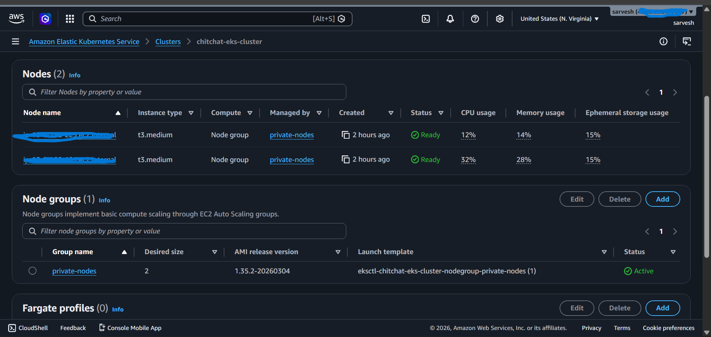
</p>

This screenshot shows:

- Managed node group  
- Private worker nodes  
- Healthy node status  

It confirms that application workloads are running inside secure private subnets.

---

###  Kubernetes Cluster State (kubectl)

<p align="center">
  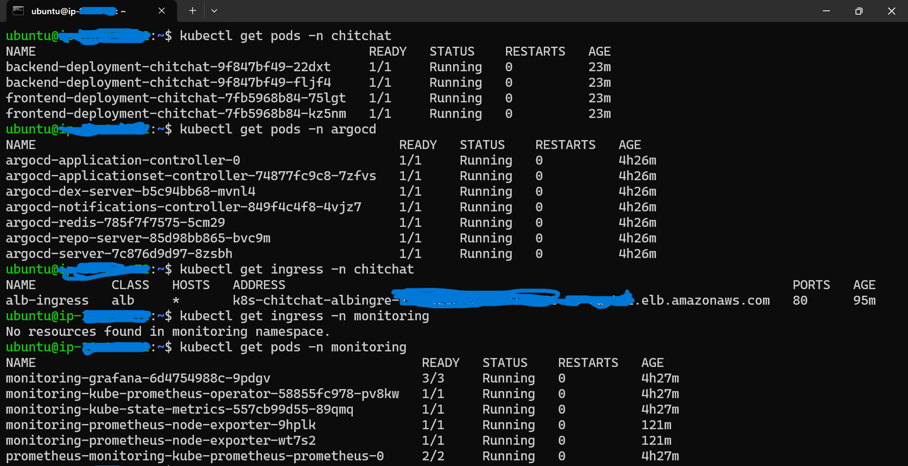
</p>

This terminal output verifies:

- Application pods are running  
- ArgoCD components are active  
- Monitoring stack (Prometheus & Grafana) is deployed  
- Ingress resource is correctly configured  

---

###  Monitoring & Observability (Grafana Dashboard)

<p align="center">
  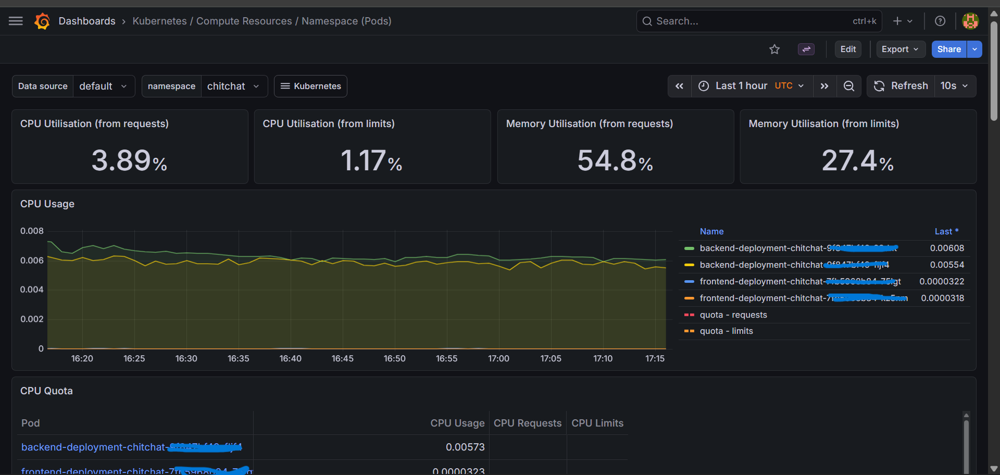
</p>

This dashboard shows real-time cluster metrics:

- CPU utilization  
- Memory usage  
- Pod-level monitoring  

It confirms that observability is fully implemented using Prometheus and Grafana.


